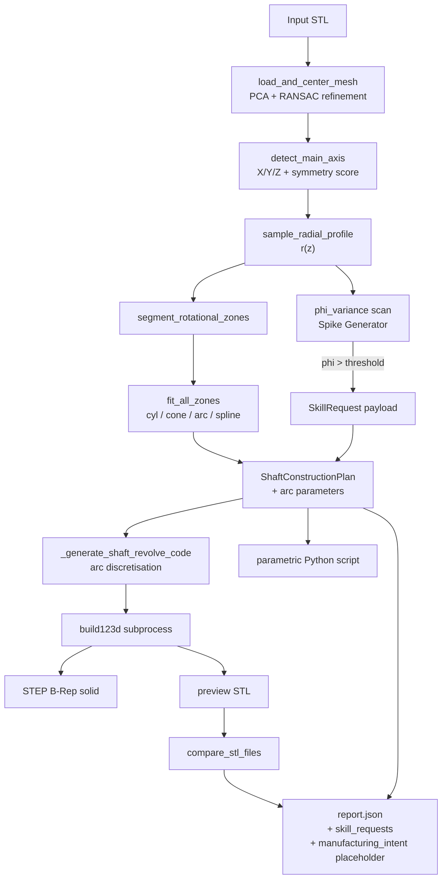

# additive-light — Deterministic Reverse Engineering

> **A blind engineer with a growing toolkit.** It feels its way around any 3D scan with deterministic measuring instruments, recognises when it needs a new instrument, can grow one on the fly, and produces an editable parametric CAD model with measurable accuracy and a manufacturing-route hypothesis.

Today the engine ships a fully deterministic pipeline for **bodies of revolution** (shafts, fillets, chamfers, tapers, barrels, hourglasses, discs). When the part contains features outside that revolution scope — keyways, cross-holes, flats — the pipeline does **not** silently smear over them: it emits a structured `SkillRequest` describing the missing tool, ready for the v2 swarm to fulfil.

## TL;DR

```bash
# 1. install deps once
pip install -r requirements.txt

# 2. reverse-engineer one part
python -m backend.pipeline.deterministic_shaft \
       benchmark_kit/ideal/ideal_short_disc_shaft.stl \
       -o temp/demo_short_disc

# 3. batch the whole bench with one command
python scripts/run_benchmark_matrix.py
```

Each run produces a triple-pack:
- a B-Rep STEP solid (`shaft.step`) — opens in any CAD package;
- an editable parametric Python script (`<stem>_parametric.py`) — every zone is a named constant;
- a JSON report (`<stem>_report.json`) — zone fits, axis confidence, reconstruction metrics, `skill_requests_generated`, `manufacturing_intent` placeholder.

## What works today (Sprint 0-3 baseline)

| STL | RMSE (mm) | IoU | Confidence | Comment |
|---|---:|---:|---:|---|
| `ideal_short_disc_shaft` | **0.003** | **1.000** | **0.998** | machine-precision on a CAD-drawn revolution body |
| `ideal_cylinder` | 0.356 | 0.986 | 0.677 | tessellation-bound baseline |
| `ideal_conical_shaft` | 0.436 | 0.975 | 0.636 | 7.7× improvement after Sprint 2 arc-gap fix |
| `ideal_hourglass_shaft` | 0.460 | 0.987 | 0.600 | concave generatrix, arc fit holds |
| `ideal_fillet_shaft` | 0.979 | 0.954 | 0.397 | three nested fillets (R0.5 / R2 / R5) |
| `Кнопка_2.stl` (real scan) | **0.042** | 0.997 | 0.949 | sub-tessellation accuracy on a real photogrammetry capture |

Source: `docs/baseline_results.json`. Full matrix: `python scripts/run_benchmark_matrix.py` writes `temp/bench_matrix/<timestamp>/{results.json, summary.md}`.

## Architecture — the blind engineer and the toolkit



Three layers, with **deterministic core first**:

1. **Deterministic toolkit (`backend/sensors/` + `backend/pipeline/`)** — Open3D, Trimesh, Shapely. Every measurement is reproducible math, no LLM. This is the hero of today's pipeline.
2. **Spike Generator (`backend/pipeline/deterministic_shaft._generate_skill_requests`)** — when `phi_variance` along the axis exceeds threshold, the engine emits a `SkillRequest` that names the missing tool (`feature_detector_for_keyway`, ...). v1 records the request in `report.json`; v2 wires it into the swarm.
3. **Skill Library (`backend/skills/`)** — Voyager-inspired tool-growing infrastructure (already present, not activated by default). See [docs/skills_library.md](docs/skills_library.md).

The extensibility layer (LangGraph swarm orchestration, agent specs in `config/agents/*.yaml`, `controlled_bootstrapper.py`) sits **alongside** the hero flow rather than on top of it. Use it once the deterministic path stops being enough.

## Components

### Sensors (`backend/sensors/`)
- `align_open3d.py` — mesh load, centering, PCA with **RANSAC refinement** for PCA-degenerate parts (Sprint 2 rescue of P8-P9).
- `shaft_axis.py` — primary axis detection by rotational symmetry score.
- `slice_trimesh.py` — 2D cross-sections with `phi_variance` per slice (Sprint 3 input for the Spike Generator).
- `shaft_profile.py` — `r(z)` profile + zone segmentation.
- `revolution_fitting.py` — cylinder / cone / arc / spline fitting.

### Pipeline (`backend/pipeline/`)
- `deterministic_shaft.py` — end-to-end STL → STEP entry point. Houses the Spike Generator and the CAPP-lite manufacturing-intent placeholder.
- `profile_metrics.py` — RMSE / IoU-proxy / confidence between source and reconstructed STL.

### Agents (`backend/agents/`)
- `coder_agent.py` — deterministic build123d script generator. Sprint 2.4 added arc discretisation for FILLET / CHAMFER zones.
- `coordinator_agent.py`, `sensor_agent.py`, `vibeguard_agent.py` — swarm-side agents, used only when LangGraph orchestration is active.

### Reports & data
- `benchmark_kit/{ideal,noise,corrupt,real_scans}/` — 30+ STL fixtures classified in [docs/bench_inventory.md](docs/bench_inventory.md).
- `benchmark_kit/expected_results.yaml` — ground truth per fixture.
- `tests/fixtures/` — minimal shafts used by the unit tests, including the Sprint 3 out-of-scope acceptance fixtures (`shaft_with_keyway`, `shaft_with_cross_hole`, `shaft_with_flat`).

## Testing

```bash
# fast, deterministic-only suite (Sprint 0-3 acceptance)
pytest tests/test_revolution_baseline.py \
       tests/test_math_enhancements.py \
       tests/test_out_of_scope_detector.py -v
```

30/30 passing as of the latest baseline.

## Documents

| Document | Purpose |
|---|---|
| [docs/skills_library.md](docs/skills_library.md) | The "growing toolkit" architecture (Voyager-style) |
| [docs/RND_REVERSE_STRATEGY.md](docs/RND_REVERSE_STRATEGY.md) | R&D direction memo |
| [docs/BODIES_OF_REVOLUTION_PLAN.md](docs/BODIES_OF_REVOLUTION_PLAN.md) | Per-phase plan for the revolution scope |
| [docs/DECISION_MEMO_TEXT2CAD.md](docs/DECISION_MEMO_TEXT2CAD.md) | Why Text-to-CAD stays frozen |
| [docs/bench_inventory.md](docs/bench_inventory.md) | Every STL in the bench, classified |
| [docs/baseline_results.json](docs/baseline_results.json) | Sprint 0 baseline numbers |
| [docs/sber500_deck.md](docs/sber500_deck.md) | Five-slide skeleton for the deeptech pitch |
| [docs/architecture.md](docs/architecture.md) | LangGraph swarm extensibility layer |
| [docs/EXPERIMENTAL_CAPP_DIRECTION.md](docs/EXPERIMENTAL_CAPP_DIRECTION.md) | The CAPP-lite roadmap that the report placeholder hooks into |

## Roadmap

- **v1 (today):** deterministic revolution pipeline + Spike Generator + measurable bench.
- **v2 (next):** activate `controlled_bootstrapper.py` to fulfil `SkillRequest` payloads — start with `feature_detector_for_keyway` and `feature_detector_for_transverse_hole`. This is the moment the swarm earns its keep.
- **v3 (later):** populate the `manufacturing_intent` section with real process-family / route hypotheses (`docs/examples/manufacturing_intent.example.yaml`).

## Design principles

1. **Deterministic tools decide.** Every metric (RMSE, IoU, axis confidence, `phi_variance`, fit residual) is plain math. No LLM in the critical path.
2. **Hypotheses are explicit.** Where the deterministic engine cannot reconstruct, it tells the next stage exactly what tool it needs, and why. No silent fallbacks.
3. **Editable parametric output.** Every run ships a build123d Python script that an engineer can re-parameterise — the STEP is the artefact, the script is the contract.
4. **Bench-driven R&D.** Sprints are scoped by `docs/baseline_results.json` and `temp/bench_matrix/<timestamp>/results.json` numbers, not by intuition.
5. **YAGNI.** No speculative features. Each milestone is justified by deeptech demo value.

## Dependencies

See `requirements.txt`. Key pins: `open3d==0.18.0`, `trimesh`, `shapely`, `scipy>=1.11`, `build123d`, `langgraph` (only for the swarm extensibility layer).

## License

VibeCraft Engineering — Internal Use Only.
