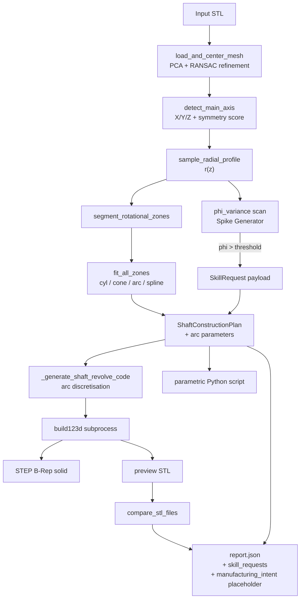

<!--
  additive-light — Deterministic Reverse Engineering
  Vibe: professional — quietly does the work, then shows the numbers.
-->

<pre align="center">
   ╔═════════════════════════════════════════════╗
   ║                                             ║
   ║   additive-light                            ║
   ║   STL  →  metrics  →  editable CAD          ║
   ║                                             ║
   ╚═════════════════════════════════════════════╝
</pre>

<h1 align="center">additive-light — Deterministic Reverse Engineering</h1>

<p align="center">
  <a href="./LICENSE">
    
  </a>
  <a href="./requirements.txt">
    
  </a>
  <a href="#testing">
    
  </a>
  <a href="https://github.com/Shugar86/additive-light/commits/develop">
    
  </a>
</p>

> **A blind engineer with a growing toolkit.** It feels its way around any 3D scan with deterministic measuring instruments, recognises when it needs a new instrument, and produces an editable parametric CAD model with measurable accuracy.

## What is it?

**additive-light** turns raw STL scans into editable, parametric CAD models — without putting a language model on the critical path. For bodies of revolution (shafts, cylinders, cones, fillets, chamfers, tapers, barrels, hourglasses, discs) the pipeline is fully deterministic: every radius, axis, and zone fit is plain math.

When the scan contains features outside that scope — keyways, cross-holes, flats — the engine does **not** silently smooth over them. It emits a structured `SkillRequest` that names the missing tool and why it is needed, so the next layer of the swarm can grow the right instrument.

## Features

- 🔬 **Deterministic geometry core** — Open3D, Trimesh, Shapely, SciPy. No LLM between STL and STEP.
- 🎯 **Triple-pack output** — a B-Rep STEP solid, an editable `build123d` Python script, and a JSON report with metrics.
- 📐 **Bodies of revolution** — shafts, discs, cylinders, cones, fillets, chamfers, tapers, barrels, hourglasses.
- ⚠️ **Honest scope boundaries** — out-of-scope features become `SkillRequest` payloads, not silent errors.
- 📊 **Bench-driven** — 30+ STL fixtures across `ideal/`, `noise/`, `corrupt/`, and `real_scans/` with RMSE / IoU / confidence metrics.
- 🧰 **Growing toolkit** — Voyager-style Skill Library and LangGraph swarm layer ready for v2 activation.

## Quick start

```bash
# 1. Clone and enter the repo
git clone https://github.com/Shugar86/additive-light.git
cd additive-light

# 2. Create a virtual environment (recommended)
python3 -m venv .venv
source .venv/bin/activate  # Windows: .venv\Scripts\activate

# 3. Install dependencies
pip install -r requirements.txt

# 4. Reverse-engineer one part
python -m backend.pipeline.deterministic_shaft \
       benchmark_kit/ideal/ideal_short_disc_shaft.stl \
       -o temp/demo_short_disc

# 5. Run the whole benchmark matrix
python scripts/run_benchmark_matrix.py
```

Each run produces:

```text
temp/demo_short_disc/
├── shaft.step                 # B-Rep solid, opens in any CAD package
├── demo_short_disc_parametric.py   # every zone is a named constant
└── demo_short_disc_report.json     # zones, fits, metrics, skill requests
```

## Architecture

The engine is built in three layers, with the deterministic core as the hero path:



| Layer | Components | Responsibility |
|---|---|---|
| **Deterministic core (v1)** | `backend/sensors/`, `backend/pipeline/` | Reproducible STL → STEP for revolution bodies |
| **Spike Generator** | `backend/pipeline/deterministic_shaft.py` | Detects out-of-scope geometry and emits `SkillRequest` |
| **Swarm / Skill Library (v2)** | `backend/agents/`, `backend/skills/`, `backend/core/` | Grows new tools when the deterministic core asks for help |

## Project structure

```text
additive-light/
├── backend/                 # Core engine and swarm layer
│   ├── agents/              # LLM-side agents (v2)
│   ├── benchmark/           # One-command demo entry point
│   ├── core/                # State, config, graph orchestration
│   ├── executor/            # Secure code execution
│   ├── pipeline/            # Deterministic STL → STEP pipeline (v1 hero)
│   ├── sensors/             # Deterministic geometric sensors
│   ├── skills/              # Voyager-style skill library
│   └── validators/          # AST safety checks
├── benchmark_kit/           # STL fixtures and ground truth
├── config/                  # Agent specs and swarm policy
├── docs/                    # Architecture memos, roadmaps, baselines
├── research/                # R&D spikes (spiroid winglet, CAPP-lite)
├── scripts/                 # Benchmark and utility scripts
├── tests/                   # Acceptance and unit tests
├── AGENTS.md                # Contract for AI agents working in this repo
├── CHANGELOG.md             # Release history
├── CONTRIBUTING.md          # How to participate
├── LICENSE                  # Apache-2.0
├── PROJECT.md               # Immutable project anchor
├── COCKPIT.md               # Personality, audiences, vibe
├── SPOTLIGHT.md             # Architecture pearls and hidden risks
├── STATE.md                 # Current focus and blockers
└── requirements.txt         # Python dependencies
```

## Examples

### Single part

```bash
python -m backend.pipeline.deterministic_shaft \
       benchmark_kit/ideal/ideal_short_disc_shaft.stl \
       -o temp/demo_short_disc
```

The report for `ideal_short_disc_shaft` looks like this:

```json
{
  "success": true,
  "part_type": "revolution_body",
  "axis_confidence": 0.9998,
  "overall_confidence": 0.9990,
  "reconstruction_metrics": {
    "rmse_mm": 0.0026,
    "iou_proxy": 0.9999,
    "confidence": 0.9975,
    "n_samples": 100
  },
  "zones": [
    { "zone_type": "cylinder", "mean_radius": 24.997, "confidence": 0.999 }
  ]
}
```

### Batch benchmark

```bash
python scripts/run_benchmark_matrix.py
```

Results land in `temp/bench_matrix/<timestamp>/`:

```text
temp/bench_matrix/2026-06-14T00-00-00/
├── results.json
└── summary.md
```

### Sprint 0–4 baseline highlights

| STL | RMSE (mm) | IoU | Confidence | Comment |
|---|---:|---:|---:|---|
| `ideal_short_disc_shaft` | **0.003** | **1.000** | **0.998** | machine-precision on a CAD-drawn revolution body |
| `ideal_cylinder` | 0.356 | 0.986 | 0.677 | tessellation-bound baseline |
| `ideal_conical_shaft` | 0.436 | 0.975 | 0.636 | 7.7× improvement after Sprint 2 arc-gap fix |
| `ideal_hourglass_shaft` | 0.460 | 0.987 | 0.600 | concave generatrix, arc fit holds |
| `ideal_fillet_shaft` | 0.979 | 0.954 | 0.397 | three nested fillets (R0.5 / R2 / R5) |
| `Кнопка_2.stl` (real scan) | **0.042** | 0.997 | **0.949** | sub-tessellation accuracy on a real photogrammetry capture |

Source: [`docs/baseline_results.json`](./docs/baseline_results.json).

## Components

### Sensors (`backend/sensors/`)

- `align_open3d.py` — mesh load, centering, PCA with **RANSAC refinement** for PCA-degenerate parts.
- `shaft_axis.py` — primary axis detection by rotational symmetry score.
- `slice_trimesh.py` — 2D cross-sections with `phi_variance` per slice.
- `shaft_profile.py` — `r(z)` profile + zone segmentation.
- `revolution_fitting.py` — cylinder / cone / arc / spline fitting.

### Pipeline (`backend/pipeline/`)

- `deterministic_shaft.py` — end-to-end STL → STEP entry point, Spike Generator, and CAPP-lite placeholder.
- `profile_metrics.py` — RMSE / IoU-proxy / confidence between source and reconstructed STL.

### Agents (`backend/agents/`)

- `coder_agent.py` — deterministic `build123d` script generator.
- `coordinator_agent.py`, `sensor_agent.py`, `vibeguard_agent.py` — swarm-side agents for v2.

## Testing

```bash
# Fast, deterministic-only acceptance suite
pytest tests/test_revolution_baseline.py \
       tests/test_math_enhancements.py \
       tests/test_out_of_scope_detector.py -v
```

30/30 passing as of the latest baseline.

## Design principles

1. **Deterministic tools decide.** Every metric is plain math. No LLM in the critical path.
2. **Hypotheses are explicit.** Where the engine cannot reconstruct, it tells the next stage exactly what tool it needs.
3. **Editable parametric output.** The STEP is the artefact; the script is the contract.
4. **Bench-driven R&D.** Sprints are scoped by numbers, not intuition.
5. **YAGNI.** No speculative features. Each milestone earns its demo value.

## Roadmap

- **v1 (today):** deterministic revolution pipeline + Spike Generator + measurable bench.
- **v2 (next):** activate `controlled_bootstrapper.py` to fulfil `SkillRequest` payloads — starting with keyway and transverse-hole detectors.
- **v3 (later):** populate `manufacturing_intent` with real process-family hypotheses.

See [docs/ROADMAP.md](./docs/ROADMAP.md) and [CHANGELOG.md](./CHANGELOG.md) for details.

## Documentation map

| Document | Purpose |
|---|---|
| [`PROJECT.md`](./PROJECT.md) | Immutable core and key technical decisions |
| [`COCKPIT.md`](./COCKPIT.md) | Product personality, audiences, emotions |
| [`SPOTLIGHT.md`](./SPOTLIGHT.md) | Architecture pearls, reuse gold, hidden risks |
| [`STATE.md`](./STATE.md) | Current focus and blockers |
| [`docs/architecture.md`](./docs/architecture.md) | LangGraph swarm extensibility layer |
| [`docs/skills_library.md`](./docs/skills_library.md) | The growing-toolkit architecture |
| [`docs/bench_inventory.md`](./docs/bench_inventory.md) | Every STL in the benchmark kit |
| [`docs/BODIES_OF_REVOLUTION_PLAN.md`](./docs/BODIES_OF_REVOLUTION_PLAN.md) | Per-phase plan for revolution bodies |

## Contributing

Improvements are welcome. Please read [`CONTRIBUTING.md`](./CONTRIBUTING.md) before opening a PR.

## License

[Apache-2.0](./LICENSE) © 2026 Shugar86.
