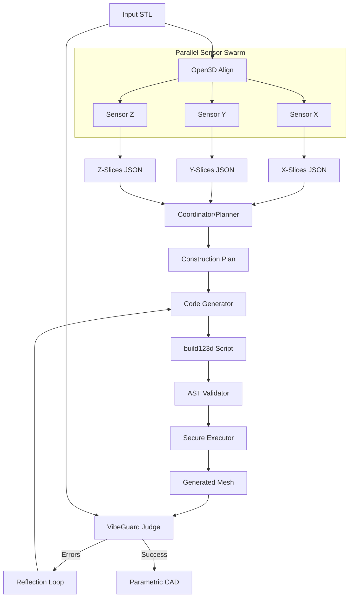

# Multi-Agent CAD-Recode Backend

Deterministic reverse engineering system that converts STL meshes into parametric CAD models using a swarm of specialized AI agents.

## Architecture

The system follows a **Swarm Intelligence** pattern with strict separation between:
- **Deterministic Tools** (mathematical sensors)
- **LLM Reasoning** (agent decisions)
- **Geometric Validation** (VibeGuard feedback loop)



## Components

### 1. Sensors (`backend/sensors/`)

Deterministic geometric analysis tools:

- **`align_open3d.py`**: Mesh alignment, centering, and PCA-based orientation
- **`slice_trimesh.py`**: Mesh slicing with Shapely-based 2D feature extraction

These modules have **zero LLM involvement** - pure mathematics.

### 2. Agents (`backend/agents/`)

LLM-based reasoning agents:

- **`sensor_agent.py`**: Fast LLM agents (X, Y, Z) that interpret sensor data
- **`coordinator_agent.py`**: Smart LLM that aggregates 3-axis data into 3D features
- **`coder_agent.py`**: Generates build123d parametric code from construction plan
- **`vibeguard_agent.py`**: Geometric judge comparing input/output meshes

### 3. Skills (`backend/skills/`)

Dynamic code generation system:

- **`skill_library.py`**: Voyager-style skill bootstrapping - agents can generate new Python tools on demand

### 4. Validation & Execution (`backend/validators/`, `backend/executor/`)

Security-critical components:

- **`ast_validator.py`**: AST-based code safety checks (import allowlists, forbidden patterns)
- **`secure_executor.py`**: Subprocess-based isolated execution with timeouts

### 5. Orchestration (`backend/core/`)

- **`state.py`**: Pydantic models for typed state flow
- **`graph.py`**: LangGraph orchestration with parallel sensor execution
- **`config.py`**: Environment-based configuration

## Usage

### Basic Usage

```python
from backend.main import process_stl

# Process an STL file
result = process_stl("path/to/model.stl", max_iterations=3)

if result.final_output:
    print("Generated build123d script:")
    print(result.final_output)
else:
    print("Failed to generate model")
    print(f"Errors: {result.geometric_errors}")
```

### CLI Usage

```bash
# Run the complete pipeline
python -m backend.main models/shaft.stl -o output -i 5

# Verbose mode for debugging
python -m backend.main models/part.stl -v
```

### Testing

```bash
# Run sensor tests
pytest tests/test_sensors.py -v

# Run all tests
pytest tests/ -v
```

## Configuration

Environment variables (or `.env` file):

```env
# LLM Configuration (optional - system works without LLM using rule-based fallback)
OPENROUTER_API_KEY=your_key
FAST_LLM_MODEL=google/gemini-flash-1.5
SMART_LLM_MODEL=anthropic/claude-3.5-sonnet

# Sensor Settings
DEFAULT_SLICE_COUNT=20
SLICE_TOLERANCE=0.01

# Validation
MAX_CODE_EXECUTION_TIME=60
CHAMFER_TOLERANCE=0.1
SAMPLE_POINT_COUNT=10000
```

## Design Principles

1. **Deterministic Tools Decide**: All geometric measurements use hard math (Trimesh, Open3D, Shapely), never LLM estimation
2. **LLMs Reason**: Agents make high-level decisions ("this looks like a cylinder") but defer measurements to tools
3. **Parallel Exploration**: Three independent agents analyze X, Y, Z simultaneously
4. **Reflection Loop**: VibeGuard provides geometric error feedback for iterative refinement
5. **Security First**: Generated code passes AST validation and runs in isolated subprocesses
6. **YAGNI**: No speculative features - only what's needed for the current task

## Dependencies

```
open3d==0.18.0      # Mesh alignment and processing
trimesh==4.4.0       # Mesh slicing and analysis
shapely==2.0.6       # 2D geometric operations
build123d==0.6.1     # Parametric CAD generation
langgraph==0.2.28    # Agent orchestration
pydantic==2.9.2      # Type-safe state management
pytest==8.3.3        # Testing
```

## License

VibeCraft Engineering - Internal Use Only