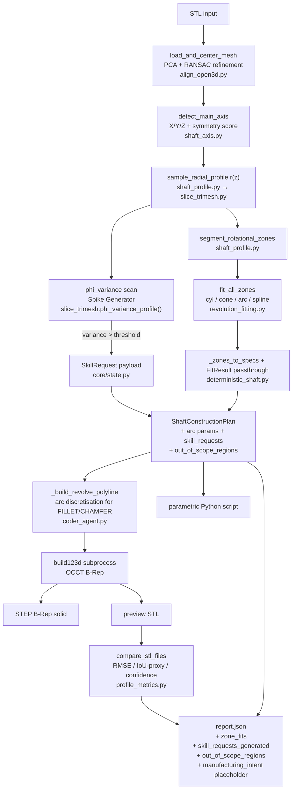
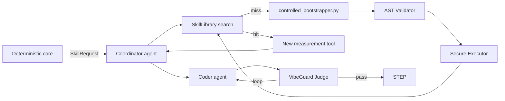

# Architecture — additive-light backend

**Last updated:** 2026-05-12 (post-Sprint 0–4, Sber500 roadmap complete)

---

## Layer overview

The backend has **three concentric layers**. Each outer layer depends on the inner one; none of them require an LLM to produce a STEP file.

```
┌─────────────────────────────────────────────────────────┐
│  v3  CAPP-lite / manufacturing_intent                    │  (planned)
│       process family, stock, tolerance hints             │
├─────────────────────────────────────────────────────────┤
│  v2  Swarm extensibility (LangGraph + Skill Library)     │  (roadmap)
│       coordinator, sensor swarm, VibeGuard, bootstrapper │
├─────────────────────────────────────────────────────────┤
│  v1  Deterministic revolution core ← SHIPPED TODAY      │  (active)
│       align → axis → r(z) → zone fit → revolve → STEP   │
└─────────────────────────────────────────────────────────┘
```

---

## 1. Deterministic revolution core (v1, active)

### Data flow



### Key modules

| Module | Purpose | Sprint |
|---|---|---|
| `backend/sensors/align_open3d.py` | PCA centering + **RANSAC refinement** for PCA-degenerate parts | Sprint 2.1-2.2 |
| `backend/sensors/shaft_axis.py` | Primary axis detection by rotational symmetry score | stable |
| `backend/sensors/slice_trimesh.py` | 2D cross-sections via Trimesh + Shapely; `phi_variance` per slice | Sprint 3.1 |
| `backend/sensors/shaft_profile.py` | `r(z)` profile + zone segmentation | stable |
| `backend/sensors/revolution_fitting.py` | `fit_cylinder / fit_cone / fit_arc` per zone | stable |
| `backend/pipeline/deterministic_shaft.py` | End-to-end STL → STEP orchestration; Spike Generator | Sprint 0–3 |
| `backend/pipeline/profile_metrics.py` | `ProfileMetrics(rmse_mm, iou_proxy, confidence)` | Sprint 0 |
| `backend/agents/coder_agent.py` | Deterministic build123d script generator; **arc discretisation** | Sprint 2.4 |
| `backend/core/state.py` | Pydantic models: `ShaftConstructionPlan`, `ShaftZoneSpec`, `SkillRequest`, `OutOfScopeRegion` | Sprint 2.4 + 3.2 |

### Triple-pack output

Every pipeline run produces:
1. **`shaft.step`** — B-Rep STEP AP203/AP214, opens in any CAD tool.
2. **`<stem>_parametric.py`** — build123d script with every zone parameter as a named constant.
3. **`<stem>_report.json`** — zone fits, axis confidence, RMSE/IoU/confidence, `skill_requests_generated`, `out_of_scope_regions`, `manufacturing_intent` placeholder.

### Spike Generator (Sprint 3)

When `phi_variance` of boundary radii along a slice exceeds `0.15` for ≥ 2 consecutive slices (with gap coalescing), the pipeline emits a `SkillRequest`:

```json
{
  "trigger": "non_revolution_region_detected",
  "region": {"z_start": -9.59, "z_end": -7.55, "max_phi_variance": 0.328, ...},
  "hypothesis": ["keyway", "flat", "transverse_hole"],
  "needs_tool": "feature_detector_for_keyway",
  "confidence": 1.0
}
```

v1: record in report. v2: wire into `controlled_bootstrapper.py` (already in repo).

---

## 2. Swarm extensibility layer (v2, roadmap)

All components exist in the repo today but are **not on the critical path** for STEP generation.



| Component | File | Status |
|---|---|---|
| Skill Library | `backend/skills/skill_library.py` | implemented, not wired |
| Controlled Bootstrapper | `backend/skills/controlled_bootstrapper.py` | implemented, not wired |
| Sensor registry | `config/sensors/registry.yaml` | implemented |
| Swarm policy | `config/swarm_policy.yaml` | implemented |
| LangGraph graph | `backend/core/graph.py` | implemented; requires `langgraph` |
| Coordinator | `backend/agents/coordinator_agent.py` | implemented; LLM call is TODO |
| VibeGuard | `backend/agents/vibeguard_agent.py` | implemented |
| Sensor agents | `backend/agents/sensor_agent.py` | implemented |

Activation path: install `langgraph`, set `OPENROUTER_API_KEY`, call `process_stl()` from `backend/main.py`.

---

## 3. CAPP-lite / manufacturing intent (v3, planned)

A proposed layer **above** the construction plan that would attach semantic manufacturing labels: process family (turning/milling/hybrid), stock assumption, primary datum hypothesis, tolerance notes, route hints. The JSON slot already exists in v1 reports:

```json
"manufacturing_intent": {
  "schema_version": "0.proposed-experimental",
  "activated": false,
  "ref": "docs/examples/manufacturing_intent.example.yaml"
}
```

Full schema design: [docs/examples/manufacturing_intent.example.yaml](examples/manufacturing_intent.example.yaml).  
Narrative: [docs/EXPERIMENTAL_CAPP_DIRECTION.md](EXPERIMENTAL_CAPP_DIRECTION.md).

---

## 4. Key technologies

| Role | Library |
|---|---|
| Geometry kernel (CAD output) | `build123d` (OCP/OpenCASCADE) → STEP B-Rep |
| Mesh I/O and slicing | `trimesh` |
| Alignment (RANSAC) | `open3d` |
| 2D geometry | `shapely` |
| Math / fitting | `numpy`, `scipy` |
| Swarm orchestration (optional) | `langgraph` |
| State models | `pydantic` |
| Tests | `pytest` |
