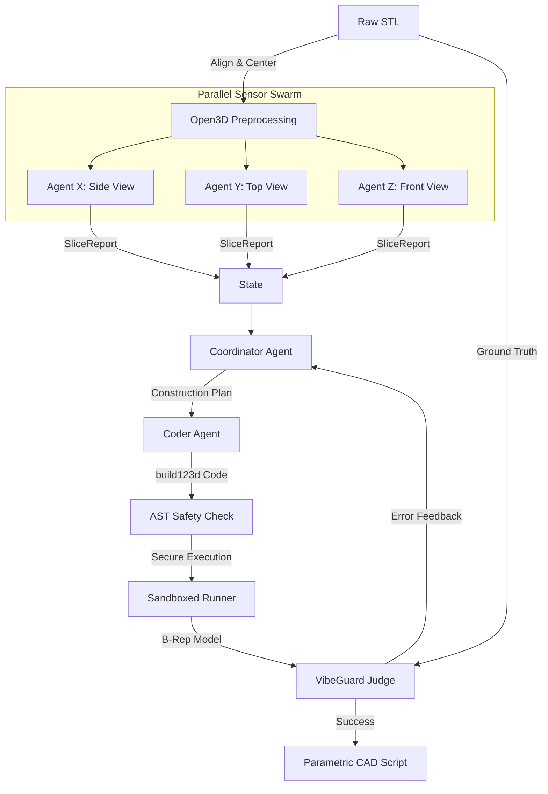
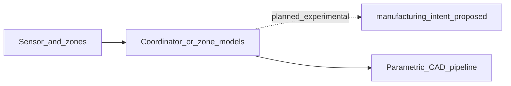

# Multi-Agent Architecture

## 1. Concept: Swarm Intelligence for Reverse Engineering

Instead of a monolithic end-to-end approach, we utilize a deterministic **Agent Swarm** pattern combined with modern AGI concepts (Tool-use, Judge/Critic, Skill Library).

**Core Philosophy:**
> **LLMs Reason. Deterministic Tools Decide.**
> *LLMs make high-level semantic decisions, while hard mathematical scripts perform exact measurements.*

### Data Flow

## 2. System Components

### 2.1 State Management (`CADState`)

The system is built on `LangGraph`, passing a strictly typed `Pydantic` state between nodes:

- **`stl_path`**: Path to input mesh
- **`sensor_reports`**: Dictionary of findings from X, Y, Z agents
- **`identified_features`**: Aggregated 3D features (cylinders, holes, slots)
- **`construction_plan`**: Step-by-step CAD instructions
- **`generated_code`**: Current Python script
- **`geometric_errors`**: Feedback from VibeGuard (Chamfer distance, local deviations)

### 2.2 Sensor Agents (The Swarm)

Three parallel agents ("The Explorers") analyze the mesh from orthogonal perspectives. They use **deterministic tools** (no hallucinations):

- **Tool:** `slice_trimesh.py`
- **Logic:** Slices the mesh, identifies 2D primitives (circles, rectangles), calculates exact dimensions.
- **Output:** Structured JSON report (`SliceReport`).

### 2.3 Coordinator (The Architect)

A smart LLM (e.g., Claude 3.5 Sonnet) that:
1. Aggregates 2D slices into 3D features (e.g., "Circle in Z-slices + Rectangle in X-slices = Cylinder").
2. Resolves conflicts between sensors.
3. Generates a **Construction Plan** (Base Sketch → Extrude → Cut → Fillet).
4. **Skill Bootstrapping:** If standard sensors fail (e.g., complex organic shape), it generates a custom Python script to analyze that specific feature.

### 2.4 Coder (The Builder)

An agent specialized in `build123d` library:
- Translates the Construction Plan into executable Python code.
- Follows strict "VibeCraft" engineering rules (no magic numbers, explicit imports).
- Implements error correction based on VibeGuard feedback.

### 2.5 VibeGuard (The Judge)

A strict geometric validation agent:
1. Compiles the generated script into a B-Rep model.
2. Samples 10,000 points from both Original STL and Generated Mesh.
3. Calculates **Chamfer Distance** and **Hausdorff Distance**.
4. Returns a **Failure Density Report**: "High deviation detected at (10, 5, 20). Expected cylinder, found cube."

## 3. Experimental layer (planned): manufacturing intent

Upstream, the pipeline already materializes **structured geometry** from sensors: `SliceReport` slices, aggregated `Feature3D` hypotheses, optional strict shaft contracts (`ShaftZoneSpec` segments, `LocalFeatureSpec`), and zone expectations used in benchmark manifests. None of that is “CAPP” by itself—it is measurement and reconstruction.

A **proposed** (not yet wired into LangGraph) layer would sit **after** that structured geometry and **alongside** the existing construction plan → coder path: it would attach **manufacturing_intent**—e.g. semantic labels for machinable features, stock/orientation hints, tolerance and operation sketches, and lightweight **process route** suggestions for human review. The goal is decision support and Q&A grounded in the same mesh and feature evidence, not a full automated process planner.

For narrative and contract sketches, see [EXPERIMENTAL_CAPP_DIRECTION.md](EXPERIMENTAL_CAPP_DIRECTION.md) and [examples/manufacturing_intent.example.yaml](examples/manufacturing_intent.example.yaml).

## 4. Key Technologies

- **Orchestration:** `LangGraph`
- **Geometry Kernel:** `build123d` (OCP/OpenCASCADE)
- **Mesh Processing:** `Trimesh`, `Open3D`, `Shapely`
- **Validation:** `AST` (security), `multiprocessing` (isolation)
