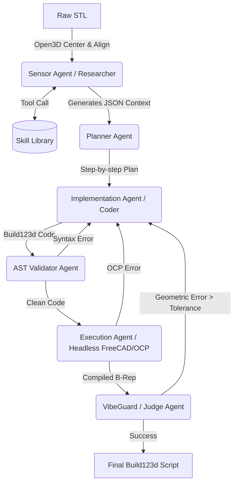

# Архитектура Multi-Agent CAD-Recode & Skill Bootstrapping (План)

Вместо нейросетевого end-to-end подхода (оригинальный CAD-Recode), мы выстраиваем детерминированный **Рой Агентов (Agent Swarm)** с использованием паттернов современного AGI (Tool-use, Judge/Critic, Skill Library) применительно к реверс-инжинирингу. 

## 1. Концепция: LLMs reason. Deterministic tools decide

- **Вход:** Неструктурированный, шумный полигональный меш (STL) и (опционально) текстовое ТЗ.
- **Сенсоры (Tools):** Жесткие математические скрипты на Python (Open3D, Trimesh, Shapely), которые LLM-агент вызывает для "ощупывания" геометрии (например, найти габариты, найти цилиндры, сделать срез по оси Z).
- **Отращиваемые щупальца (Skill Bootstrapping):** Если текущих сенсоров не хватает для анализа сложной детали, агент-исследователь пишет кастомный Python-скрипт (на numpy/scipy/open3d), тестирует его, и при успехе — сохраняет в библиотеку навыков (Skill Library, как в проекте Voyager) для использования в будущем.
- **Выход (Синтез):** Скрипт на `build123d`, который гарантирует редактируемую параметрику (B-Rep).
- **VibeGuard (Судья-Метролог):** Независимый агент, который компилирует сгенерированный скрипт в STEP/STL, сравнивает его с исходным мешем (рассчитывая Chamfer Distance или Hausdorff distance) и возвращает точную геометрическую дельту с указанием "где ошибка" обратно Синтезатору.

---

## 2. Оркестрация Роя Агентов (LangGraph)

Система базируется на графе состояний (`LangGraph`), передающем между узлами строго типизированный `State` (например, `Pydantic` модели).

### 2.1 Агент-Сенсор (Researcher)

**Инструменты из коробки:**

- `open3d_align()`: Загрузка STL через Open3D, вычисление центра масс и главных осей (PCA/RANSAC), центрирование детали в `(0,0,0)` и выравнивание (ось вращения -> ось Z).
- `trimesh_slice()` + `shapely_analyze()`: Нарезка выровненного вала/детали на 2D-слои (как колбасу). Извлечение 2D-полигонов. Использование `Shapely` для поиска аномалий (шпоночные пазы, отверстия, лыски) путем сравнения площади сечения с описанной окружностью.
- `pyRANSAC_fit()`: Поиск примитивов (плоскости основания, цилиндры) для извлечения базовых параметров.

### 2.2 Агенты Синтеза (Planner & Coder)

- **Planner:** Получает JSON-отчет от Сенсора (список найденных цилиндров, пазов, фасок). Формирует текстовый "план действий" для `build123d` (например: 1. Base Sketch, 2. Extrude, 3. Cut Keyway, 4. Fillets).
- **Implementation Agent (Coder):** Пишет код на `build123d`.
  - *LLM Client:* OpenAI SDK (base_url: OpenRouter / AIStudio). Поддержка Kimi 2.5, Gemini 3.1 Pro/Flash-Lite.

### 2.3 Агенты Валидации (AST, Executor, VibeGuard)

- **Validation Agent (AST):** Проверяет синтаксис Python, безопасность импортов (запрет `os`, `sys`) и корректность API-вызовов `build123d` (Runner Contract).
- **Execution Agent:** Локальный Headless-запуск скрипта в изолированном процессе (`subprocess`), отлов `StdFail` от геометрического ядра (OCP).
- **VibeGuard (Судья):**
  - Семплирует 10 000 точек со сгенерированной B-Rep модели и с исходного STL.
  - Вычисляет `Chamfer Distance` / `SDF Loss`.
  - Формирует *Failure Density Report* (например: "Ось Z совпадает, но фаска на ребре 5мм вместо 2мм. Координаты ошибки: (X,Y,Z)").
  - Замыкает цикл Рефлексии (Reflection Loop), отправляя ошибку обратно Coder-у.

---

## 3. RoadMap внедрения (Для Agent Mode)

1. Создать структуру папок `backend/agents`, `backend/sensors`, `backend/skills`.
2. Написать базовые сенсоры `align_open3d.py` и `slice_trimesh.py`.
3. Настроить базовый граф `LangGraph` (`graph.py`).
4. Написать промпты и роли для `Planner` и `Coder`.
5. Реализовать `VibeGuard` (метрика расстояния между двумя мешами).
6. Добавить цикл рефлексии (Reflection prompt) при ошибке от VibeGuard.