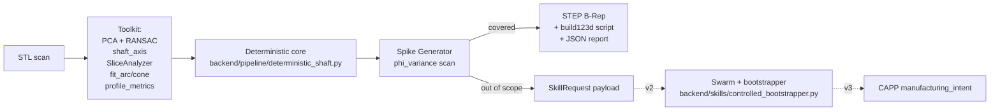

# Sber500 — additive-light · deeptech deck

Five-slide markdown skeleton. Convert with any markdown-to-slides tool
(reveal.js, Marp, Slidev) or read top-to-bottom. Each slide has a
**talking points** block plus the concrete repo artefact that backs it
up — the deck is **bench-driven**, not slogan-driven.

---

## Slide 1 — Problem

**Reverse engineering a mechanical part today is one of two bad options:**

- **Manual CAD bureau workflow** — operator opens scan in Geomagic / PolyWorks / Creo RE, hand-fits primitives, weeks per part, accuracy as good as the operator.
- **LLM-CAD prototypes** — fast, fluent text input, but produce mesh approximations with no editable parameters and no accuracy guarantees. Not a tool an engineer can trust on a drawing.

**Our claim:** there is a third path — a deterministic engine that measures the part with mathematical sensors first, and only escalates to LLM/swarm when geometry alone cannot answer.

> "We are building a blind engineer with a growing toolkit of measuring instruments who feels its way around a 3D mesh and produces a parametric CAD model — and learns new instruments on the fly."

**Backing artefacts:** [README.md](../README.md), [docs/RND_REVERSE_STRATEGY.md](RND_REVERSE_STRATEGY.md).

---

## Slide 2 — Architecture (the blind engineer + toolkit)



**Three layers, deterministic core first.**

1. **Toolkit.** Open3D + Trimesh + Shapely + SciPy + build123d. Every measurement reproducible math, no LLM in the critical path. Code in [backend/sensors/](../backend/sensors/), [backend/pipeline/profile_metrics.py](../backend/pipeline/profile_metrics.py).
2. **Spike Generator.** When `phi_variance` along the axis exceeds the threshold, the engine emits a `SkillRequest` — explicitly naming the missing tool. v1 records the request; v2 fulfils it via the [controlled bootstrapper](../backend/skills/controlled_bootstrapper.py) (Voyager-style, already in repo).
3. **Skill Library.** Persistent tool inventory ([config/sensors/registry.yaml](../config/sensors/registry.yaml), [backend/skills/skill_library.py](../backend/skills/skill_library.py)) backed by an AST validator and secure executor.

**Talking point.** Slide 1 said "third path". This is what makes the third path defensible — the toolkit, not the model. Anyone can wire GPT to OpenSCAD; growing a measurable deterministic toolkit is the moat.

---

## Slide 3 — Live numbers (Sprint 0-3 baseline)

Run the demo: **`python -m backend.benchmark`** writes everything below into `temp/sber500/<timestamp>/{report.json, summary.md, previews/*.png}` in ~30 seconds.

| STL | RMSE (mm) | IoU | Confidence | Note |
|---|---:|---:|---:|---|
| `ideal_short_disc_shaft.stl` | **0.003** | **1.000** | **0.998** | machine-precision on synthetic |
| `Кнопка_2.stl` (real scan) | **0.042** | 0.997 | 0.949 | sub-tessellation on a real photogrammetry capture |
| `ideal_cylinder.stl` | 0.356 | 0.986 | 0.677 | tessellation-bound baseline |
| `ideal_conical_shaft.stl` | 0.445 | 0.975 | 0.636 | **7.7× improvement from Sprint 2 arc-gap fix** (3.365 → 0.445) |
| `ideal_hourglass_shaft.stl` | 0.460 | 0.987 | 0.600 | concave generatrix |
| `ideal_fillet_shaft.stl` | 0.979 | 0.954 | 0.397 | three nested fillets (R0.5 / R2 / R5) |
| `ideal_chamfer_shaft.stl` | 1.127 | 0.956 | 0.382 | three chamfers (30° / 45° / 60°) |
| `shaft_with_keyway.stl` | 0.907 | 0.982 | 0.430 | revolution part + 4 SkillRequests (Slide 4) |

**Three things to highlight.**

1. **Sub-tessellation accuracy** on the hero short disc and on a **real scan** — that is *measurement noise*, not algorithm error.
2. **Sprint 2 arc-gap fix** dropped conical RMSE 7.7× and hourglass 1.7× with a single deterministic change.
3. **30/30 unit tests green** (`pytest tests/test_revolution_baseline.py tests/test_math_enhancements.py tests/test_out_of_scope_detector.py`).

**Backing artefacts:** [docs/baseline_results.json](baseline_results.json), [docs/bench_inventory.md](bench_inventory.md), `temp/sber500/<timestamp>/`.

---

## Slide 4 — Honest engineering: Spike Generator → Swarm v2

The most credible deeptech demo is the one that **knows what it cannot do** and tells you. When we hit a keyway, cross-hole or flat, the engine emits a structured request:

```json
{
  "trigger": "non_revolution_region_detected",
  "region": {"z_start": -9.59, "z_end": -7.55,
             "max_phi_variance": 0.328, "sample_count": 6,
             "mean_radius_mm": 14.7},
  "hypothesis": ["keyway", "flat", "transverse_hole"],
  "needs_tool": "feature_detector_for_keyway",
  "confidence": 1.0
}
```

- v1 today: emit the request, surface it in `report.json`, do not silently smear over the feature with an averaged radius.
- v2 next: feed the request into [controlled_bootstrapper.py](../backend/skills/controlled_bootstrapper.py). The bootstrapper generates a Python tool, validates it through the AST checker, runs it in the secure executor, persists it in [backend/skills/library/](../backend/skills/library/). Each new part adds capability.
- v3 later: link the deterministic geometry to the `manufacturing_intent` sidecar ([docs/examples/manufacturing_intent.example.yaml](examples/manufacturing_intent.example.yaml)) — process family, stock assumption, tolerance notes. The CAPP-lite slot is already in the report.

**Why this matters for the pitch.** It is the same story arc as Voyager (cited in [docs/skills_library.md](skills_library.md)) — start with a fixed toolkit, grow it on demand, persist what worked. We did not invent the metaphor; we ship the deterministic anchor underneath it.

---

## Slide 5 — Industrial use case + ask

**Who needs this today.** Reverse-engineering bureaus, OEM maintenance teams, additive-manufacturing service providers, university research labs. They all start from a scan and finish in CAD. We compress that loop from weeks to minutes with **editable** output (STEP + Python script + JSON manifest).

**Three near-term lighthouse partners to pursue.** RE bureaus with shaft-heavy backlogs, an additive OEM doing in-line scan-to-print, a university lab teaching reverse engineering (open-source friendly).

**What we are asking from Sber500.**

1. Access to **2-3 industrial pilots** with real scans of revolution parts. Our `Кнопка_2.stl` line in Slide 3 is the proof we can already handle a noisy real input; we need volume to calibrate `phi_variance` thresholds and validate the manufacturing-intent slot.
2. Mentorship on **deeptech go-to-market** — enterprise on-prem licensing vs open-core, defensive publication strategy for the zone-fitting + Spike Generator method.
3. A runway buffer for one **computational-geometry R&D engineer** to activate the v2 bootstrapper without distracting the founder from BD.

**What we deliver in return.** A reproducible deeptech demo with measurable metrics that does not look like "yet another LLM-CAD wrapper" — because it isn't.

> Run `python -m backend.benchmark` on your laptop. Read `report.json`. Open `shaft.step` in any CAD tool. Edit `shaft_with_keyway_parametric.py` and re-run. Everything is reproducible from this repo.
