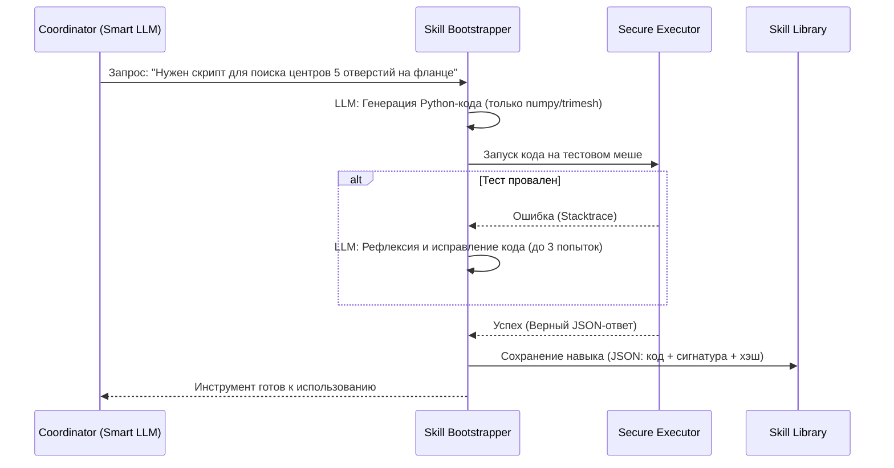

# Skill Bootstrapping (Библиотека Навыков)

## 1. Концепция: "Отращивание щупалец"

В основе Multi-Agent CAD-Recode лежит принцип **"Детерминированные инструменты + Умная LLM"**. По умолчанию агенты-сенсоры используют базовые, жестко закодированные математические инструменты (нарезка меша, поиск центров, анализ полигонов с помощью `trimesh` и `shapely`).

Однако базовая геометрия покрывает не все сценарии. Что если деталь имеет:
- Сложную криволинейную поверхность (NURBS-подобную)?
- Специфический паттерн отверстий (например, круговой массив под углом 45 градусов)?
- Резьбу или шестерню?

Здесь вступает в работу механизм **Skill Bootstrapping** (вдохновленный проектом [Voyager](https://voyager.minedojo.org/)). Если Агент-Координатор понимает, что текущих сенсорных данных недостаточно для уверенной реконструкции, он инициирует процесс создания нового инструмента (Навыка).

## 2. Архитектура Skill Bootstrapper

Процесс генерации нового навыка автономен и состоит из следующих шагов:



## 3. Структура Навыка (Skill)

Каждый сгенерированный навык сохраняется в `backend/skills/library/` в виде JSON-файла. Это обеспечивает персистентность — система "учится" решать новые классы геометрических задач и сохраняет этот опыт между запусками.

### Пример JSON-структуры навыка:

```json
{
  "name": "find_circular_pattern_centers_20260305",
  "description": "Находит центры кругового массива отверстий на заданном радиусе",
  "signature": {
    "input": {
      "mesh_path": "str",
      "base_radius": "float",
      "hole_count": "int"
    },
    "output": {
      "centers": "list[list[float]]",
      "confidence": "float"
    }
  },
  "code": "def find_circular_pattern_centers_20260305(mesh_path: str, base_radius: float, hole_count: int) -> dict:\n    import numpy as np\n    import trimesh\n    # ... детерминированная математика ...\n    return {'centers': result, 'confidence': 0.95}",
  "success_count": 12,
  "failure_count": 0,
  "created_at": "2026-03-05T21:00:00.000000",
  "code_hash": "a1b2c3d4e5f6g7h8"
}
```

## 4. Правила генерации кода (VibeCraft Engineering)

Сгенерированные навыки обязаны подчиняться строгим правилам:

1. **Только детерминированная математика:** Внутри сгенерированного скрипта **ЗАПРЕЩЕНО** использовать LLM или вероятностные API. Скрипт должен использовать `numpy`, `scipy`, `trimesh` или `open3d` для точных расчетов.
2. **Безопасность (Sandboxing):** Код выполняется в изолированной среде через `AST Validator`. Запрещены импорты `os`, `sys`, `subprocess` (кроме явно разрешенных). Запрещены сетевые запросы.
3. **Строгая типизация:** Входные и выходные данные должны строго соответствовать заявленной сигнатуре (обычно это возврат словаря с конкретными ключами).
4. **Устойчивость (Resilience):** Код должен содержать `try...except` блоки и возвращать осмысленное сообщение об ошибке (например, `{"error": "Массив отверстий не найден, confidence 0.1"}`), а не падать с `IndexError`.

## 5. Поиск и переиспользование

Когда Координатор получает новую деталь, он сначала делает поиск по семантическому описанию в `Skill Library`.
- Навыки сортируются по `success_count` (надежности).
- Если подходящий инструмент найден, он динамически подгружается (через `exec` в ограниченном namespace) и применяется к новому мешу.
- Это делает систему быстрее и умнее с каждой обработанной деталью.