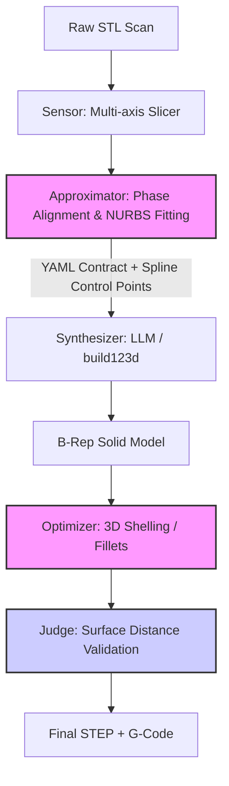

# 🧪 R&D Эксперимент: Реконструкция сложной аэродинамики (Spiroid Winglet)
**Статус:** `NON-PROD` / `PROOF-OF-CONCEPT`  
**Связь с GDI:** Стресс-тест модулей Sensor, Approximator и Judge на органической (непримитивной) геометрии.

---

## 1. Суть эксперимента
**Цель:** Перевести сырую оболочку (Shell STEP/STL) аэродинамического законцовки крыла (spiroid) в параметрическую или хотя бы твердотельную (Solid/Watertight Mesh) модель с внутренней полостью (shelling) для FDM-печати.

**Идея (Пайплайн v3):**
1. **Sensor:** Нарезать исходный Mesh на плоские сечения (30-40 шт) вдоль оси X.
2. **Approximator:** Очистить контуры, сделать равномерный ресэмплинг (по 96 точек на кольцо).
3. **Synthesizer:** Сшить сечения обратно во внешнюю оболочку.
4. **Optimizer (Shelling):** Сделать эквидистантный отступ (offset) внутрь для создания толщины стенки и вычесть его из внешней оболочки.
5. **Judge:** Сравнить получившуюся модель с эталоном через двунаправленный сэмплинг поверхности.

---

## 2. Технологический стек
- **CAD Ядро:** `build123d` (OCP / OpenCASCADE) — *показало ограничения на сырых данных.*
- **Mesh Процессинг:** `trimesh`, `rtree` (для быстрых proximity-запросов).
- **Булевы операции:** `manifold3d` (Mesh-були) — *строго требует watertight.*
- **2D Геометрия:** `shapely` (офсеты контуров).
- **Триангуляция:** `mapbox-earcut`, `triangle` (закрытие торцов).

---

## 3. Архитектура данных (Контракт)

Для передачи данных между этапами мы выработали гибридный контракт: тяжелые массивы точек лежат в JSON, а метаданные и параметры генерации — в YAML.

### Схема `sections_clean.json` (Сенсорная выгрузка)
```json
{
  "meta": {
    "source_step": "Spiroid winglet left.step",
    "resample_points": 96,
    "bbox_x_mm": [0.0, 180.0]
  },
  "sections": [
    {
      "index": 0,
      "plane_x_mm": 1.5,
      "centroid_y_mm": -3.36,
      "centroid_z_mm": 0.49,
      "points_sketch_uv_mm": [[1.71, -2.06], /* ... 96 точек ... */]
    }
  ]
}
```

### Схема `wing_tip_spec.yaml` (Спецификация для Синтезатора)
```yaml
units_mm: true
mount_geometry_locked:
  # Фиксация посадочного места крыла
  root_section_index: 0
  plane_x_mm: 1.5
  centroid_yz_mm: [-3.36, 0.49]
model:
  skin_mm: 1.2
  min_wall_mm: 0.95
reconstruction:
  tolerance_comparison_mm: 1.0
  comparison_sample_count: 12000
```

---

## 4. Ключевые находки и Инсайты (The "Meat")

### 🔴 Проблема 1: B-Rep (OCCT) ненавидит сырые облака точек
**Что делали:** Пытались скормить 37 полилиний по 96 точек в `build123d.loft()`.
**Результат:** Ошибки `Standard_NoSuchObject`, падение ядра. OCCT пытается построить тяжелейшие NURBS-поверхности, проходящие строго через каждую точку (интерполяция), что приводит к математическим сингулярностям на малейшем шуме.
**💡 Инсайт для GDI:** Нельзя передавать сырые точки из Sensor напрямую в LLM/Synthesizer для B-Rep. Нужен промежуточный шаг в Approximator — **NURBS Fitting (Аппроксимация B-сплайнами)**. Нужно сжимать 96 точек в сплайн из 8-12 контрольных точек.

### 🔴 Проблема 2: Скручивание сетки (Twist Effect) при сшивке
**Что делали:** Сшивали точку $i$ на сечении $N$ с точкой $i$ на сечении $N+1$ (Mesh Quads).
**Результат:** Из-за стреловидности крыла передняя кромка смещается. Прямые линии пошли наискосок, сетка "скрутилась", появились микро-самопересечения.
**💡 Инсайт для GDI:** При реконструкции органики необходима **Синхронизация фаз (Phase Alignment)**. Алгоритм должен находить "нулевую точку" (например, точку максимальной кривизны — переднюю кромку) на каждом сечении и циклически сдвигать массивы точек так, чтобы кромки совпадали. Еще лучше — извлекать **Guide Curves (Направляющие)** и делать лофт по ним.

### 🔴 Проблема 3: 2D-Офсет не работает для аэродинамики
**Что делали:** Пытались сделать толщину стенки (shelling), применяя `shapely.buffer(-1.2)` к каждому 2D-сечению.
**Результат:** На острой задней кромке крыла буфер мгновенно выворачивается наизнанку, полигон разбивается на куски (`MultiPolygon`) или исчезает. Кроме того, 2D-офсет не равен 3D-толщине стенки (косинусная ошибка на наклонных участках).
**💡 Инсайт для GDI:** Офсет для создания скорлупы нужно делать **только в 3D**. Либо воксельный офсет через `manifold3d`, либо встроенный `shell()` в CAD-ядре уже после получения идеального твердого тела.

### 🟢 Успех 1: Mesh-були через Manifold3D
После того как мы аккуратно закрыли торцы через `earcut` и сделали `merge_vertices`, внешняя сетка стала `watertight=True`. После этого `trimesh.boolean.difference(engine="manifold")` отработал идеально, вырезав внутреннюю полость.
**💡 Инсайт для GDI:** `manifold3d` — ультимативный инструмент для булевых операций над сетками, но он требует математически идеальной топологии на входе.

### 🟢 Успех 2: Двунаправленная валидация (Judge)
Мы написали скрипт `compare_reference_rebuild.py`, который не просто смотрит на Bounding Box, а берет 12 000 случайных точек на эталоне и ищет кратчайшее расстояние до реконструированной модели (и наоборот).
**💡 Инсайт для GDI:** Это готовый, мощный алгоритм для модуля `Judge`. Он выдает метрики: `mean`, `p50`, `p95`, `p99`, `max` отклонения. Это позволяет объективно оценить качество реконструкции (IoU для 3D).

---

## 5. Как это интегрировать в основной репозиторий GDI



### Что забрать в GDI прямо сейчас:
1. **Код из `compare_reference_rebuild.py`**: Перенести в `gdi_core/judge/`. Использование `trimesh.sample.sample_surface` + `rtree` (`nearest.on_surface`) — это золотой стандарт для проверки точности генерации.
2. **Код из `extract_spiroid_sections.py`**: Функции нарезки Mesh плоскостями и ресэмплинга по длине дуги (`arc_length_resample_closed`) — перенести в `gdi_core/sensors/`.
3. **Требование к `manifold3d`**: Добавить в `requirements.txt` GDI как бекенд по умолчанию для сложных Mesh-операций.

## 6. Вердикт
Подход "от сечений к модели" — рабочий, но "в лоб" (через соединение точек прямыми) он дает артефакты на сложной органике. Для интеграции в продакшен GDI требуется математическая прослойка (NURBS фиттинг и выравнивание фаз), которая переведет дискретные точки в гладкие математические функции до того, как они попадут в CAD-ядро.